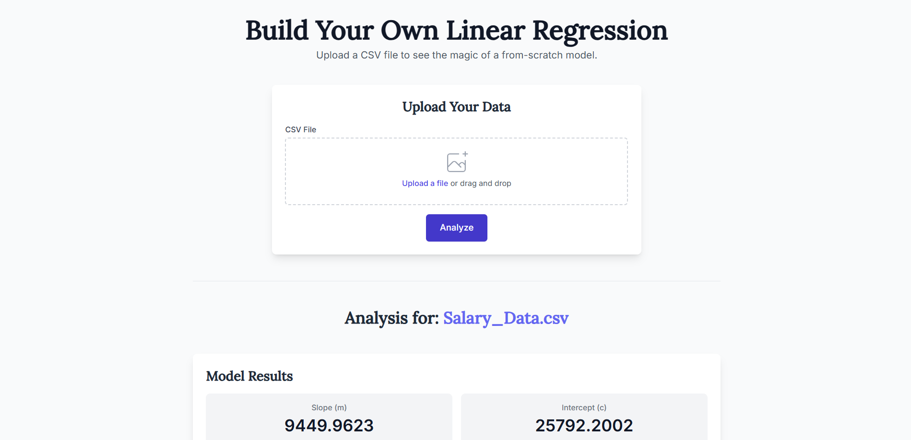

# Build Your Own Linear Regression

An interactive web application that allows users to upload their own CSV data and perform a linear regression analysis using a model built from scratch.

<!-- Replace the placeholder with an actual screenshot of your app -->


---

## 📌 About This Project
This project was built to demonstrate a fundamental machine learning algorithm—**linear regression**—in a practical, hands-on way. Instead of relying on a pre-built library function, this application features a `SimpleLinearRegression` class developed from scratch using **Python** and **NumPy**.  
It showcases the core concepts of model fitting and prediction in a **user-friendly web interface**.

The application allows anyone to upload a **two-column CSV file**, and it will automatically:

- Read the data using Pandas.
- Fit the custom linear regression model to the data.
- Display the resulting **slope**, **intercept**, and **regression equation**.
- Generate a scatter plot of the data with the calculated line of best fit.

---

## ✨ Features
- **Custom Linear Regression Model** – No Scikit-learn; implemented from scratch with NumPy.
- **File Upload Functionality** – Upload your own CSV files for analysis.
- **Dynamic Results** – Displays slope, intercept, and regression equation instantly.
- **Data Visualization** – Scatter plot with regression line using Matplotlib + Seaborn.
- **Data Preview** – Shows the first few rows of the dataset.
- **Clean UI** – HTML + Tailwind CSS frontend.

---

## 🛠 Tech Stack
- **Backend:** Python, Flask  
- **Data Handling:** Pandas, NumPy  
- **Data Visualization:** Matplotlib, Seaborn  
- **Frontend:** HTML, Tailwind CSS, JavaScript  
- **Deployment:** Gunicorn, Render (or any PaaS)  

---

## 🚀 Getting Started

### Prerequisites
- Python 3.9+
- pip

### Installation
Clone the repository:
```bash
git clone https://github.com/your-username/linear-regression-app.git
cd linear-regression-app
